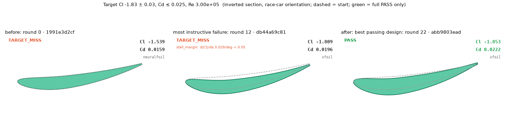

# Run 20261001-201455-faf6a3

- LLM client: **anthropic:claude-sonnet-5**
- LLM health: **valid**
- Termination: **target_met** (a design passed every check at XFoil)
- Limits: evaluations 23 / 40; est. LLM cost $1.4691 (cap $2.00); wall clock 0.28 h / 0.5 h
- Target: Cl = -1.83 ± 0.03, Cd ≤ 0.025, Re = 3.000e+05
- LLM calls: 69, tokens in/out: 264277/94058

## LLM calls by agent

| agent | ok | failed | fallbacks |
|---|---|---|---|
| chief | 23 | 0 | 0 |
| cad | 23 | 0 | 0 |
| critic | 23 | 0 | 0 |
| **total** | 69 | 0 | 0 |

failed = the call raised, was refused or returned nothing (a real-LLM run with more than 2 is aborted); fallbacks = a deterministic output replaced the agent's.

## Best passing design

A full PASS: XFoil (not a fallback), in the target box, attached, with a stall margin.

`abb9803ead` (gen 22, xfoil), status **PASS**
- Cl = -1.8526, Cd = 0.02222, objective = 0.0226
- Stall margin d|Cl|/dα = 0.068/deg (threshold 0.05)
- Stall-margin plot: [stall_abb9803ead.png](stall_abb9803ead.png)
- Params: `{"main_camber":0.09,"main_camber_pos":0.36,"main_thickness":0.13,"alpha_deg":8.3487,"flap_chord_ratio":0.0,"flap_deflection_deg":0.0,"slot_gap":0.015,"slot_overlap":0.0,"gurney_h":0.0}`

## Ledger

| gen | cid | fidelity | status | Cl | Cd | stall d\|Cl\|/dα | NF screen | quarantined |
|---|---|---|---|---|---|---|---|---|
| 0 | 1991e3d2cf | neuralfoil | TARGET_MISS | -1.5392 | 0.01585 |  | stall | False |
| 1 | 12784e216f | neuralfoil | TARGET_MISS | -1.6322 | 0.01617 |  | stall | False |
| 2 | ec42779fb4 | neuralfoil | TARGET_MISS | -1.6587 | 0.01691 |  | ok | False |
| 3 | 0a154ac3a1 | neuralfoil | TARGET_MISS | -1.8153 | 0.01918 |  | stall | False |
| 4 | db44a69c81 | neuralfoil | TARGET_MISS | -1.7993 | 0.01943 |  | ok | False |
| 5 | a2a5c630d5 | neuralfoil | TARGET_MISS | -1.8290 | 0.01995 |  | stall | False |
| 6 | 136dc1ff45 | neuralfoil | TARGET_MISS | -1.6850 | 0.01817 |  | ok | False |
| 7 | 81b3351c10 | neuralfoil | PASS | -1.8289 | 0.02051 |  | ok | False |
| 8 | 81b3351c10 | xfoil | TARGET_MISS | -1.8381 | 0.02043 | 0.034 | ok | False |
| 9 | 4af1b12444 | neuralfoil | TARGET_MISS | -1.8290 | 0.01996 |  | stall | False |
| 10 | 1efba4a9a0 | neuralfoil | TARGET_MISS | -1.8288 | 0.01995 |  | stall | False |
| 11 | 1020049d0d | neuralfoil | TARGET_MISS | -1.8292 | 0.01996 |  | stall | False |
| 12 | db44a69c81 | xfoil | TARGET_MISS | -1.8093 | 0.01959 | 0.029 | ok | False |
| 13 | f3f8c79d9f | neuralfoil | TARGET_MISS | -1.7948 | 0.02050 |  | ok | False |
| 14 | 7670e8aaaf | neuralfoil | PASS | -1.8045 | 0.01992 |  | ok | False |
| 15 | 7670e8aaaf | xfoil | TARGET_MISS | -1.8093 | 0.01983 | 0.047 | ok | False |
| 16 | fd80bc033e | neuralfoil | TARGET_MISS | -1.8299 | 0.01829 |  | stall | False |
| 17 | 74e34b9aae | neuralfoil | TARGET_MISS | -1.7988 | 0.02031 |  | ok | False |
| 18 | 9fdb8063d1 | neuralfoil | TARGET_MISS | -1.8067 | 0.01903 |  | stall | False |
| 19 | 4483e2ca4d | neuralfoil | TARGET_MISS | -1.8070 | 0.01913 |  | stall | False |
| 20 | a1405db08d | neuralfoil | TARGET_MISS | -1.7994 | 0.02141 |  | ok | False |
| 21 | abb9803ead | neuralfoil | PASS | -1.8294 | 0.02200 |  | ok | False |
| 22 | abb9803ead | xfoil | PASS | -1.8526 | 0.02222 | 0.068 | ok | False |

`*` = lower-fidelity fallback. Only XFoil PASS rows are passing designs; a NeuralFoil PASS is a lower-tier result. NF screen = NeuralFoil stall (alpha+1/+2) and suction-side separation screen. All numbers above come from ledger.jsonl.

## NeuralFoil screen

Blocked from promotion to XFoil (near the target at NeuralFoil, screen failed):

- gen 16 `fd80bc033e`: NeuralFoil stall screen: d|Cl|/dalpha 0.038/deg < 0.05
- gen 11 `1020049d0d`: NeuralFoil stall screen: d|Cl|/dalpha 0.049/deg < 0.05
- gen 9 `4af1b12444`: NeuralFoil stall screen: d|Cl|/dalpha 0.049/deg < 0.05
- gen 5 `a2a5c630d5`: NeuralFoil stall screen: d|Cl|/dalpha 0.049/deg < 0.05
- gen 10 `1efba4a9a0`: NeuralFoil stall screen: d|Cl|/dalpha 0.049/deg < 0.05
- gen 3 `0a154ac3a1`: NeuralFoil stall screen: d|Cl|/dalpha 0.041/deg < 0.05
- gen 19 `4483e2ca4d`: NeuralFoil stall screen: d|Cl|/dalpha 0.046/deg < 0.05
- gen 18 `9fdb8063d1`: NeuralFoil stall screen: d|Cl|/dalpha 0.043/deg < 0.05

Screen vs XFoil on the same geometry (XFoil is authoritative):

| gen | cid | screen d\|Cl\|/dα | XFoil d\|Cl\|/dα | screen TE H | XFoil TE sep x/c | disagree |
|---|---|---|---|---|---|---|
| 8 | 81b3351c10 | 0.052 | 0.034 | 2.82 |  | stall |
| 12 | db44a69c81 | 0.055 | 0.029 | 2.63 |  | stall |
| 15 | 7670e8aaaf | 0.056 | 0.047 | 2.68 |  | stall |
| 22 | abb9803ead | 0.059 | 0.068 | 3.22 |  | - |

Stall: screen and XFoil both use d|Cl|/dα ≥ 0.05 (XFoil only when its probe ran). Separation: screen warns at suction-side TE H ≥ 4.25.

## Stall-margin plots (XFoil candidates)

- gen 8 `81b3351c10`: d|Cl|/dα 0.034/deg < 0.05 — [stall_81b3351c10.png](stall_81b3351c10.png)
- gen 12 `db44a69c81`: d|Cl|/dα 0.029/deg < 0.05 — [stall_db44a69c81.png](stall_db44a69c81.png)
- gen 15 `7670e8aaaf`: d|Cl|/dα 0.047/deg < 0.05 — [stall_7670e8aaaf.png](stall_7670e8aaaf.png)
- gen 22 `abb9803ead`: d|Cl|/dα 0.068/deg ok — [stall_abb9803ead.png](stall_abb9803ead.png)

